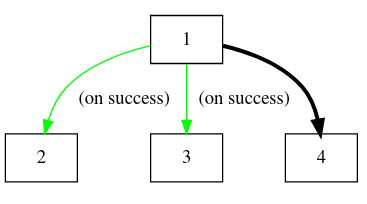

# The key `exec_workflow`

This key is string and allow to set all your workflow configuration process with the ID of the **Jobs**

The **Jobs** have an alphanumerical string `[a-zA-Z0-9_]` so let's suppose that we have 4 **Jobs** with IDs `1`,`2`,`3` and `4` for examples.

The `exec_workflow` control if your workflow is sequential or parallel with commas `,` and colons `:` and you can play with this.

For example, if `exec_workflow` value is `1:2:3:4` means that your workflow is:

!!! note ""
    One job at a time in sequential form

If `exec_workflow` value is `1,2:3:4` means that your workflow is:

!!! note ""
    Jobs with IDs `1` and `2` executes in parallel

If `exec_workflow` value is `1,2:3,4` means that your workflow is:

!!! note ""
    Jobs with IDs `1` and `2` executes in parallel and when both completes then `3` and `4` execute in parallel

The workflow defined in `exec_workflow` global key does not take into account the events. These are configured in every job. See [Handle Jobs events](Handle-jobs-events.md). But for preview, let's see this example:

Imagine there are 4 **Jobs** configured in your package, with sames ID but here we going to use events for calling the other jobs. This is the configuration:
Job `1` call `2` and `3` when ocurrs a SUCCESS event, and after calls `4`.

So the configuration for `exec_workflow` is `1:4` and the job `1` will have configured his local `exec_workflow` for `event_success` with value `2,3`. The workflow is:

!!! note ""
    `4` is called after `1` and all his events complete. More examples in [Handle Jobs events](Handle-jobs-events.md)
